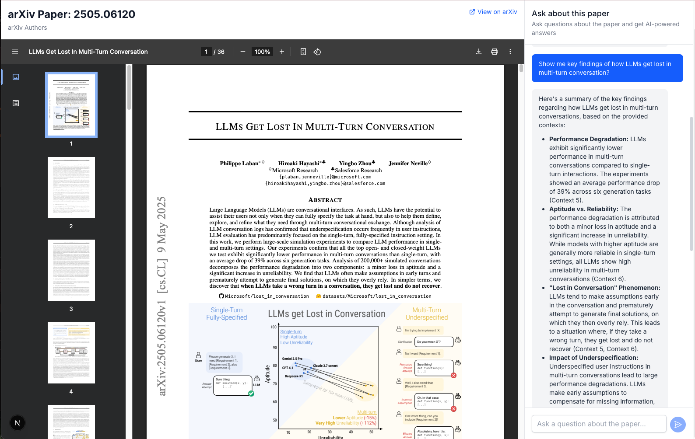
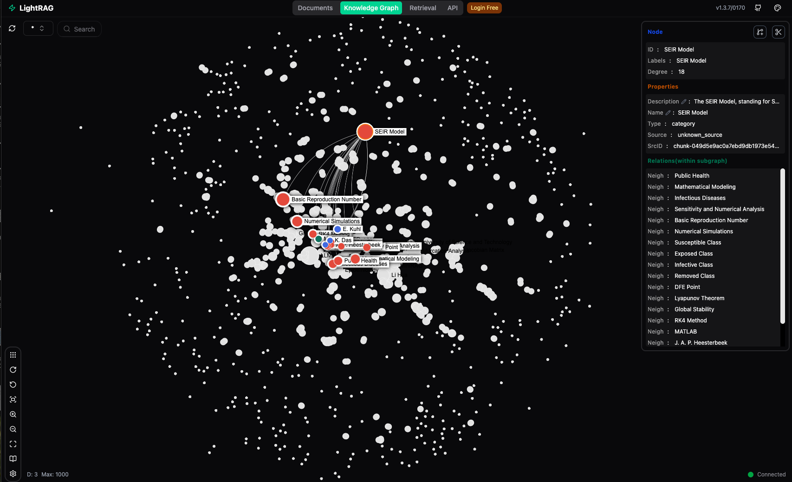

# AlphaXIV-Open



My own open-source implementation of AlphaXIV that allows users to chat with arXiv papers. This project uses FastAPI for the backend, markitdown for PDF conversion, MiniRAG for indexing, and Google's Gemini API for chat completions.

## Demo

https://github.com/user-attachments/assets/e8eae8af-ad38-4e70-913e-60022157784b


[](https://buymeacoffee.com/sheing)
[](https://tip.md/sng-asyncfunc)
[](https://x.com/sashimikun_void)
[](https://discord.com/invite/VQMBGR8u5v)

## Features

- Process arXiv papers by URL
- Convert PDFs to markdown using Microsoft's markitdown
- Index content using MiniRAG
- Chat with papers using Google's Gemini API
- Support for larger document context lengths

## How It Works

AlphaXIV combines several powerful technologies to enable intelligent conversations with academic papers. Here's how it works behind the scenes:

### Document Processing Flow

When a user submits an arXiv paper URL, the system processes it through the following steps:

```mermaid
graph TD
    %% Document Processing Flow
    A[User inputs arXiv URL] --> B[Download PDF from arXiv]
    B --> C[Convert PDF to Markdown using Markitdown]
    C --> D[Process and clean Markdown content]
    D --> E[Split content into chunks]

    %% MiniRAG Heterogeneous Graph Indexing
    E --> F1[Extract named entities from chunks]
    E --> F2[Generate embeddings with OpenAI]
    F1 --> G1[Create entity nodes]
    F2 --> G2[Create text chunk nodes]
    G1 --> G3[Build entity-entity connections]
    G1 --> G4[Build entity-chunk connections]
    G2 --> G4
    G3 & G4 --> G5[Generate semantic descriptions for edges]
    G5 --> G6[Construct semantic-aware heterogeneous graph]

    subgraph "PDF Processing"
    B
    C
    D
    E
    end

    subgraph "Heterogeneous Graph Indexing"
    F1
    F2
    G1
    G2
    G3
    G4
    G5
    G6
    end

    class B,C,D,E processing;
    class F1,F2,G1,G2,G3,G4,G5,G6 indexing;
```

### Question Answering Flow

When a user asks a question about a paper, the system processes it through these steps:

```mermaid
graph TD
    %% Query Processing
    H[User asks question] --> I1[Extract entities from query]
    I1 --> I2[Predict potential answer types]
    I1 & I2 --> I3[Map query to graph entities]

    %% Graph-Based Knowledge Retrieval
    I3 --> J1[Identify starting nodes via semantic matching]
    J1 --> J2[Discover answer-aware entity nodes]
    J1 & J2 --> J3[Apply topology-enhanced graph retrieval]
    J3 --> J4[Score and rank reasoning paths]
    J4 --> J5[Retrieve connected text chunks]

    %% Response Generation
    J5 --> K[Combine query + retrieved context]
    K --> L[Send to Gemini API]
    L --> M[Return response to user]

    subgraph "Query Semantic Mapping"
    I1
    I2
    I3
    end

    subgraph "Topology-Enhanced Retrieval"
    J1
    J2
    J3
    J4
    J5
    end

    subgraph "Response Generation"
    K
    L
    M
    end

    class I1,I2,I3 mapping;
    class J1,J2,J3,J4,J5 retrieval;
    class K,L,M generation;
```

The system operates in five sophisticated phases:

1. **PDF Processing**: When you submit an arXiv URL, AlphaXIV downloads the PDF, converts it to Markdown using Microsoft's Markitdown tool, cleans the content, and splits it into manageable chunks.

2. **Heterogeneous Graph Indexing**: MiniRAG creates a semantic-aware knowledge graph with two types of nodes:
   - Entity nodes extracted from the text (concepts, terms, equations)
   - Text chunk nodes containing the original content

   The system then builds connections between these nodes (entity-entity and entity-chunk) and generates semantic descriptions for each edge, creating a rich graph structure that captures the paper's knowledge.

   

3. **Query Semantic Mapping**: When you ask a question, the system extracts entities from your query, predicts potential answer types, and maps these to the graph entities, creating an efficient bridge between your question and the knowledge graph.

4. **Topology-Enhanced Retrieval**: Unlike traditional vector-based retrieval, MiniRAG uses a sophisticated graph traversal approach:
   - Identifies starting nodes through semantic matching
   - Discovers potential answer nodes based on predicted types
   - Applies topology-enhanced graph retrieval to find meaningful reasoning paths
   - Scores and ranks these paths based on relevance and structural importance
   - Retrieves the connected text chunks that contain the most relevant information

5. **Response Generation**: The retrieved context chunks are combined with your query and sent to Google's Gemini API, which generates a comprehensive response that leverages both the semantic content and the structural relationships captured in the graph.

## Prerequisites

- Python 3.9+
- [Markitdown](https://github.com/microsoft/markitdown) for PDF conversion
- [MiniRAG](https://github.com/HKUDS/minirag) for indexing/embedding
- Google API key for Gemini
- OpenAI API key for embeddings

## Why Markitdown and MiniRAG?

### Markitdown

[Markitdown](https://github.com/microsoft/markitdown) is Microsoft's powerful document conversion tool that transforms various file formats (including PDFs) into clean, structured Markdown. We chose Markitdown for AlphaXIV because:

- **High-quality PDF conversion**: Markitdown excels at preserving the structure of academic papers, including tables, equations, and figures
- **Semantic understanding**: It maintains the semantic structure of documents, making the content more accessible for RAG systems
- **LLM integration**: Markitdown can work with LLMs to provide descriptions for images found in documents
- **Extensibility**: The plugin system allows for custom document converters if needed

## Performance Optimization

### Batch Embedding

The system uses OpenAI embeddings for document indexing. For better performance, you can configure batch processing with the following environment variables:

- `EMBEDDING_BATCH_NUM`: Controls the batch size for embedding computations (default: 32)
- `EMBEDDING_FUNC_MAX_ASYNC`: Controls the maximum number of concurrent embedding function calls (default: 16)

Increasing these values can improve performance when processing large documents, but may require more memory.

### MiniRAG (LightRAG)

[MiniRAG](https://github.com/HKUDS/minirag) (distributed as LightRAG) is a lightweight, efficient Retrieval Augmented Generation system designed for simplicity and performance, based on the research paper ["MiniRAG: Towards Extremely Simple Retrieval-Augmented Generation"](https://arxiv.org/abs/2501.06713). We chose MiniRAG because:

- **Graph-based indexing**: Unlike traditional vector-based RAG systems, MiniRAG employs a graph-based approach that captures the relationships between document chunks, creating a more semantically rich representation of academic papers (see the knowledge graph visualization above)
- **Superior semantic understanding**: The graph structure preserves the hierarchical nature of academic papers (sections, subsections, references), enabling more contextually relevant retrievals and a deeper understanding of complex academic content
- **Enhanced retrieval accuracy**: By considering both semantic similarity and structural relationships, MiniRAG can retrieve more accurate context for complex scientific queries
- **Optimized for smaller models**: Works efficiently with smaller, free language models while maintaining high performance
- **Flexible embedding options**: Supports various embedding models including OpenAI's text-embedding models
- **Simple API**: Provides a clean, easy-to-use API for document indexing and retrieval
- **Streaming support**: Enables streaming responses for better user experience
- **Customizable retrieval**: Allows fine-tuning of chunk sizes, overlap, and retrieval parameters

When working with academic papers, MiniRAG's approach offers concrete benefits:

1. **Better handling of mathematical content**: The graph structure helps maintain relationships between equations and their explanations, providing more coherent responses to technical questions
2. **Improved cross-referencing**: When a paper references earlier sections or citations, MiniRAG can follow these connections to retrieve the complete context
3. **More accurate answers to complex queries**: For questions that require synthesizing information from multiple sections of a paper, the graph-based retrieval provides more comprehensive context than simple vector similarity

## Installation

### Option 1: Quick Setup

1. Clone the repository:
   ```bash
   git clone https://github.com/AsyncFuncAI/alphaxiv-open
   cd alphaxiv-open
   ```

2. Run the setup script:
   ```bash
   ./setup.sh
   ```

   This will:
   - Create a virtual environment
   - Install the required dependencies
   - Create a `.env` file from the example
   - Create the necessary directories

3. Edit the `.env` file and add your Google API key, OpenAI API key, and other configuration options.

### Option 2: Setup with MiniRAG (Recommended)

1. Clone the repository:
   ```bash
   git clone https://github.com/AsyncFuncAI/alphaxiv-open.git
   cd alphaxiv-open
   ```

2. Run the setup script with the MiniRAG option:
   ```bash
   ./setup.sh --with-minirag
   ```

   This will:
   - Create a virtual environment
   - Install the required dependencies
   - Install MiniRAG (LightRAG)
   - Create a `.env` file from the example
   - Create the necessary directories

3. Edit the `.env` file and add your Google API key, OpenAI API key, and other configuration options.

### Option 3: Manual Setup

1. Clone the repository:
   ```bash
   git clone https://github.com/AsyncFuncAI/alphaxiv-open.git
   cd alphaxiv-open
   ```

2. Create a virtual environment:
   ```bash
   python -m venv venv
   source venv/bin/activate  # On Windows: venv\Scripts\activate
   ```

3. Install dependencies:
   ```bash
   pip install -r requirements.txt
   ```

4. (Optional) Install MiniRAG:
   ```bash
   pip install lightrag-hku[api]
   ```

5. Create a `.env` file from the example:
   ```bash
   cp .env.example .env
   ```

6. Edit the `.env` file and add your Google API key, OpenAI API key, and other configuration options.

## Usage

### Option 1: Without MiniRAG (Basic Functionality)

1. Start the FastAPI server:
   ```bash
   uvicorn app.main:app --reload
   ```

2. The API will be available at `http://localhost:8000`.

3. Use the following endpoints:
   - `POST /api/papers/process`: Process an arXiv paper URL
   - `POST /api/chat`: Chat with a processed paper

In this mode, the application will still process papers and convert them to markdown, but will use a simple keyword-based retrieval system instead of MiniRAG for context retrieval.

### Option 2: With MiniRAG (Full Functionality)

1. Install MiniRAG:
   ```bash
   pip install lightrag-hku[api]
   ```

2. Configure your `.env` file with your OpenAI API key for embeddings:
   ```
   OPENAI_API_KEY=your_openai_api_key_here
   ```

3. Start the MiniRAG server with OpenAI embeddings using the provided script:
   ```bash
   python start_minirag.py
   ```

   This script will read configuration from your `.env` file and start the MiniRAG server with the correct settings.

   Alternatively, you can start the server manually:
   ```bash
   lightrag-server --working-dir ./data/storage --chunk-size 1000 --chunk-overlap-size 200 --embedding-dim 1536 --cosine-threshold 0.4 --top-k 10 --embedding-binding openai --embedding-model text-embedding-3-small --openai-api-key your_openai_api_key_here
   ```

   Note:
   - Replace `your_openai_api_key_here` with your actual OpenAI API key, or the server will read it from the environment variable
   - The `--top-k 10` parameter increases the number of context chunks returned (default is 5), which improves response quality for complex papers
   - The `--embedding-dim 1536` parameter matches OpenAI's text-embedding-3-small model dimension

4. In a separate terminal, start the FastAPI server:
   ```bash
   uvicorn app.main:app --reload
   ```

5. The API will be available at `http://localhost:8000`.

6. Use the following endpoints:
   - `POST /api/papers/process`: Process an arXiv paper URL
   - `POST /api/chat`: Chat with a processed paper

In this mode, the application will use MiniRAG with OpenAI embeddings for advanced context retrieval, providing better results for complex academic papers.

## API Documentation

Once the server is running, you can access the API documentation at:
- Swagger UI: `http://localhost:8000/docs`
- ReDoc: `http://localhost:8000/redoc`

## Example Requests

### Process a Paper

```bash
curl -X POST "http://localhost:8000/api/papers/process" \
     -H "Content-Type: application/json" \
     -d '{"arxiv_url": "https://arxiv.org/abs/2201.08239"}'
```

### Chat with a Paper

```bash
curl -X POST "http://localhost:8000/api/chat" \
     -H "Content-Type: application/json" \
     -d '{"paper_id": "2201.08239", "query": "What is the main contribution of this paper?"}'
```

## Project Structure

```
alphaxiv/
├── app/
│   ├── main.py                  # FastAPI entry point
│   ├── models/
│   │   ├── __init__.py
│   │   └── schemas.py           # Pydantic models
│   └── services/
│       ├── __init__.py
│       ├── arxiv_service.py     # Service for arXiv papers
│       ├── markdown_service.py  # Service for markdown conversion
│       ├── indexing_service.py  # Service for indexing with MiniRAG
│       └── gemini_service.py    # Service for Gemini API
├── data/
│   ├── papers/                  # Storage for papers
│   ├── index/                   # Storage for indices
│   └── storage/                 # Storage for MiniRAG
├── .env.example                 # Example environment variables
├── requirements.txt             # Dependencies
└── README.md                    # This file
```

## Acknowledgements

- [arXiv](https://arxiv.org/) for providing access to research papers
- [Microsoft's markitdown](https://github.com/microsoft/markitdown) for PDF conversion
- [MiniRAG](https://github.com/HKUDS/minirag) for indexing and retrieval
- [Google's Gemini API](https://ai.google.dev/) for chat completions
- [OpenAI](https://openai.com/) for text embeddings

## Contributing

Contributions are welcome! Feel free to:
- Open issues for bugs or feature requests
- Submit pull requests to improve the code
- Share your feedback and ideas

## License

This project is licensed under the MIT License - see the LICENSE file for details.
